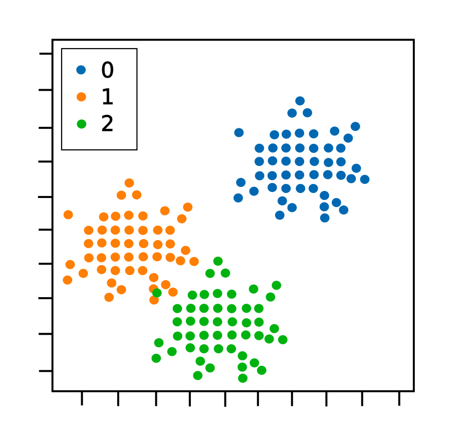

# Types of Classification Tasks - Machine Learning

## 1. Classification
In machine learning, **classification** refers to a predictive modeling problem where a class label
is predicted for a given example of input data.

Examples include:
* Given an example, classify if it is spam or not.
* Given a handwritten character, classify it as one of the known characters.
* Given recent user behavior, classify as churn or not.

## 2. Statistical Classification
**Statistical classification** is when classification is performed on a computer where statistical methods are normally used to develop the algorithm.

A **classifier** is an algorithm that implements classification, especially in a concrete implementation.

## 3. Types of Classification Tasks in Machine Learning
The 4 types of classifications tasks in Machine Learning are:
* Binary Classification
* Multi-Class Classification
* Multi-Label Classification
* Imbalanced Classification

## 4. Binary Classification
**Binary Classification**: refers to those classification tasks that have two class labels.

Examples include:
* Email spain detection (spam or not)
* Churn prediction (churn or not)
* Conversion prediction (buy or not)

The class for the normal state is assigned the class label 0 and the class with the abnormal state is assigned the class label 1.

Popular algorithms used for binary classification include:
* Logistic Regression
* k-Nearest Neighbors
* Decision Trees
* Support Vector Machine
* Naive Bayes

## 5. Multi-Class Classification
**Multi-Class Classification**: refers to those classification tasks that have more than two class labels.

Examples include:
* Face classification
* Plant species classification
* Optical character recognition

Popular algorithms used for multi-class classification include:
* k-Nearest Neighbors
* Decision Trees
* Naive Bayes
* Random Forest
* Gradient Boosting

This involves using a strategy of fitting multiple binary classification models for each class vs. all other classes (called one-vs-rest) or one model for each pair of classes (called one-vs-one).

* **One-vs-Rest**: Fit one binary classification model for each class vs. all other classes.
* **One-vs-One**: Fit one binary classification model for each pair of classes.

Binary classification algorithms that can use these strategies for multi-class classification include:
* Logistic Regression.
* Support Vector Machine.

## 6. Multi-Label Classification
**Multi-Label Classification**: refers to those classification tasks that have two or more class labels, where one or more class labels may be predicted for each example.

Specialized versions of the standard classification algorithms can be used, so-called multi-label versions of the algorithms, including:
* Multi-label Decision Trees
* Multi-label Random Forests
* Multi-label Gradient Boosting

## 7. Imbalanced Classification
**Imbalanced Classification**: refers to the classification tasks where the number of examples in each class is unequally distributed.

### 7.1 Imbalance Classification Tasks
Usually, <u>imbalance classification tasks</u> are binary classification tasks where the majority of examples in the training dataset belong to the normal class and a minority of examples belong to the abnormal class.

Examples include:
* Fraud detection
* Outlier detection
* Medical diagnostic tests

### 7.2 Specialized Techniques
<u>Specialized techniques</u> may be used to change the composition of samples in the training dataset by undersampling the majority class or oversampling the minority class.

Examples include:
* Random Undersampling
* SMOTE Oversampling

### 7.3 Specialized Modeling Algorithms
<u>Specialized modeling algorithms</u> may be used that pay more attention to the minority class when fitting the model on the training dataset, such as cost-sensitive machine learning algorithms.

Examples include:
* Cost-sensitive Logistic Regression
* Cost-sensitive Decision Trees
* Cost-sensitive Support Vector Machines

### 7.4 Alternative Performance Metrics
Finally, <u>alternative performance metrics</u> may be required as reporting the classification accuracy may be misleading.

Examples include:
* Precision
* Recall
* F-Measure

## 8. Scatter Plot of Different Types of Classifications
### 1. Binary Classification Dataset

### 2. Multi-Class Classification Dataset

### 3. Imbalanced Binary Classification Dataset

## 9. Resources
* [4 Types of Classification Tasks in Machine Learning - Machine Learning Mastery](https://machinelearningmastery.com/types-of-classification-in-machine-learning/) 
* Wikipedia
    * [Classification](https://en.wikipedia.org/wiki/Classification) 
    * [Statistical classification](https://en.m.wikipedia.org/wiki/Statistical_classification) 
    * [Binary classification](https://en.wikipedia.org/wiki/Binary_classification)
    * [Multiclass classification](https://en.wikipedia.org/wiki/Multiclass_classification)
    * [Multi-label classification](https://en.wikipedia.org/wiki/Multi-label_classification)
* [Multiclass and multilabel algorithms - scikit-learn API](https://scikit-learn.org/stable/modules/multiclass.html) 
